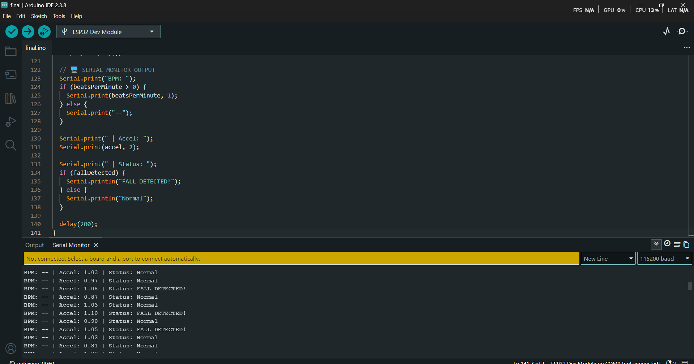
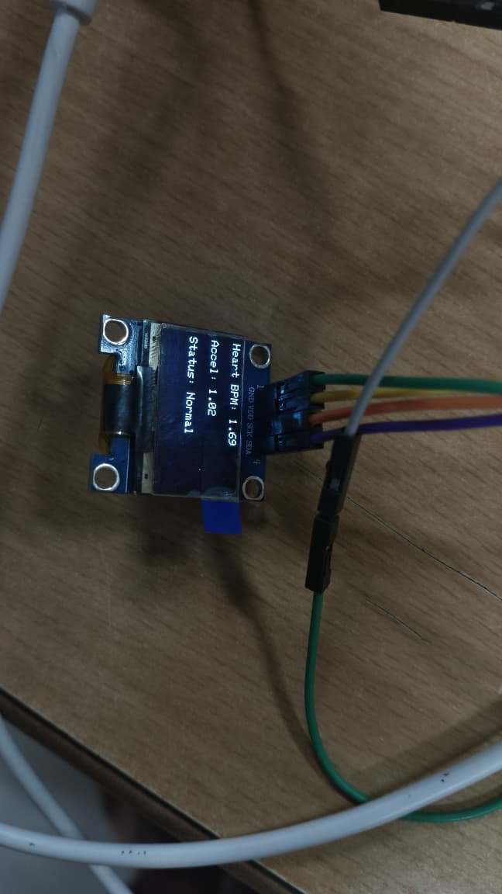

# IoT Elderly Care System (ESP32) — Heart Rate + Fall Detection

An intelligent elderly care system designed to monitor health vitals and detect emergency situations in real-time. Built with an **ESP32**, this project integrates **fall detection (MPU6050)** and **heart rate monitoring (MAX30102)** to improve the safety of elderly users.

---

## Table of Contents
- [Project Overview](#project-overview)
- [Features](#features)
- [System Output (Screenshot)](#system-output-screenshot)
- [Hardware Requirements](#hardware-requirements)
- [Wiring / Pin Configuration](#wiring--pin-configuration)
- [Software Requirements](#software-requirements)
- [Installation & Setup](#installation--setup)
- [How It Works](#how-it-works)
- [Usage](#usage)
- [Troubleshooting](#troubleshooting)
- [Future Improvements](#future-improvements)
- [License](#license)

---

## Project Overview

This system continuously:
- Reads **BPM** from a **MAX30102** sensor
- Tracks motion/orientation via **MPU6050** to detect falls
- Shows status and live values on a **0.96" SSD1306 OLED**
- Triggers a **local emergency LED** instantly upon fall detection
- Logs sensor readings and status to the **Serial Monitor** (115200 baud)

---

## Features

- **Real-time Heart Rate Monitoring:** Tracks BPM using the **MAX30102** pulse oximeter sensor  
- **Fall Detection:** Uses an **MPU6050** accelerometer/gyroscope to detect sudden impact or abnormal orientation changes  
- **Local Visual Alerts:** 0.96" OLED shows live health data and status alerts  
- **Emergency LED Indicator:** Physical LED turns ON immediately when a fall is detected  
- **Serial Debugging:** Continuous logging to Serial Monitor at **115200 baud**

---

## System Output (Screenshot)

Add your images to a folder like `assets/` and update the paths below.

### OLED Display / Serial Monitor



---

## Hardware Requirements

| Component | Purpose |
|----------|---------|
| ESP32 DevKit V1 | Main microcontroller (WiFi/Bluetooth enabled) |
| MPU6050 | 3-axis accelerometer & gyroscope (fall detection) |
| MAX30102 | Pulse oximeter & heart-rate sensor |
| SSD1306 OLED (128x64, I2C) | Live display |
| LED + resistor | Local visual alarm |

---

## Wiring / Pin Configuration

### I2C Bus (ESP32 default)
- **SDA:** GPIO **21**
- **SCL:** GPIO **22**

### Alarm LED
- **LED Pin:** GPIO **15** (use a resistor in series, e.g., 220Ω)

> All I2C modules (MPU6050, MAX30102, SSD1306) share the same SDA/SCL lines.

---

## Software Requirements

- **Arduino IDE** (or PlatformIO)
- ESP32 board support installed in Arduino IDE
- Libraries:
  - **Adafruit_SSD1306**
  - **Adafruit_GFX**
  - **MPU6050** (Jeff Rowberg)
  - **SparkFun MAX3010x**

---

## Installation & Setup

### 1) Clone the repository
```bash
git clone https://github.com/yourusername/iot_elderly_care_system.git
cd iot_elderly_care_system
```

### 2) Install required libraries (Arduino IDE)
In **Arduino IDE → Tools → Manage Libraries**, install:
- Adafruit SSD1306
- Adafruit GFX Library
- MPU6050 (Jeff Rowberg)
- SparkFun MAX3010x

> If your MPU6050 library depends on I2Cdev, install **I2Cdevlib** as required by the chosen MPU6050 package.

### 3) Select board and port
- **Board:** ESP32 Dev Module (or ESP32 DevKit V1 equivalent)
- **Port:** Select the correct COM port

### 4) Upload
Open the project `.ino` file and click **Upload**.

### 5) Serial Monitor
Open **Serial Monitor** and set:
- **Baud rate:** `115200`

---

## How It Works

- **MAX30102** continuously measures pulse signals; BPM is computed and displayed on the OLED.
- **MPU6050** measures acceleration/gyro changes; the firmware detects a fall based on thresholds (impact/orientation).
- If a fall is detected:
  - The **alarm LED** is triggered immediately
  - OLED displays an emergency message/status
  - Serial output logs the event

> You may need to fine-tune fall detection thresholds depending on sensor placement and real-world use.

---

## Usage

1. Power the ESP32 (USB or external power).
2. Wear/place the sensors appropriately (stable contact for MAX30102).
3. Observe:
   - OLED shows BPM + status
   - Serial Monitor logs live readings
4. When a fall is detected:
   - LED turns ON
   - Display shows emergency status

---

## Troubleshooting

- **No OLED display**
  - Confirm I2C wiring and power
  - Check OLED address (common: `0x3C`)
- **MAX30102 not reading**
  - Ensure good finger contact and stable positioning
  - Verify sensor wiring and I2C address
- **Frequent false fall alerts**
  - Adjust fall detection thresholds
  - Ensure MPU6050 is firmly mounted (loose mounting causes spikes)
- **I2C conflicts**
  - Run an I2C scanner to verify addresses and bus health

---

## Future Improvements

- Push notifications via Wi-Fi (SMS/Telegram/MQTT)
- Cloud dashboard for caregivers
- GPS module integration for location-based emergencies
- On-device buzzer + acknowledgment button
- Better fall detection using sensor fusion / ML classifier
